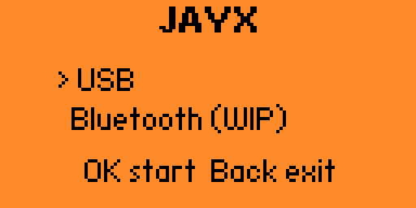
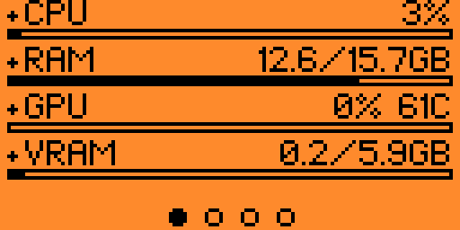
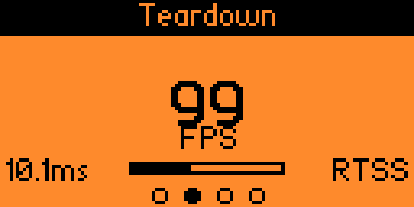
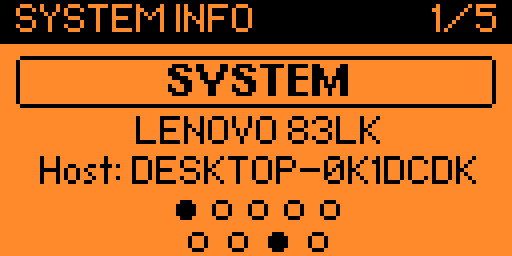
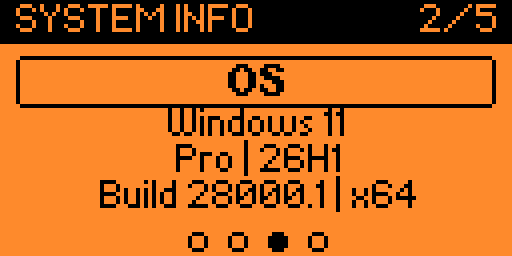
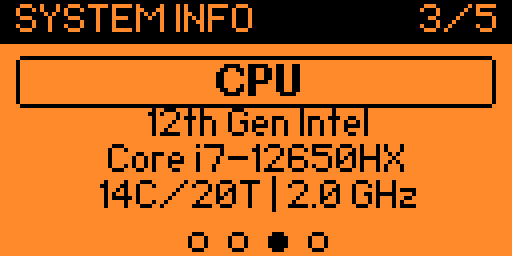
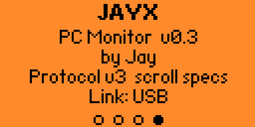
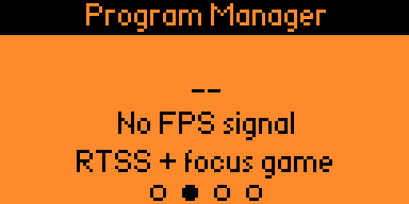

# JAYX

Live PC monitor for [Flipper Zero](https://flipperzero.one) — CPU, RAM, GPU, temps, FPS, and system info over USB.

Built with [ufbt](https://github.com/flipperdevices/flipperzero-ufbt).

**Bluetooth is still in development** — check this repo for updates. Use USB for now.

## Screenshots

| Main menu | Live stats | FPS |
| :---: | :---: | :---: |
|  |  |  |

| System info | OS | CPU |
| :---: | :---: | :---: |
|  |  |  |

| About | No game / FPS idle | Bluetooth (WIP) |
| :---: | :---: | :---: |
|  |  |  |

## Quick start

### 1. Build & install on Flipper

```sh
cd apps/jayx
ufbt              # build → dist/jayx.fap
ufbt launch       # install & run (Flipper on USB)
```

On device: **Apps → USB → JAYX** → select **USB** → OK.

### 2. Run the PC agent (Windows)

```sh
cd pc_agent
pip install -r requirements.txt
python monitor.py --usb
```

| Optional feature | Need |
| --- | --- |
| GPU % / VRAM / GPU temp | NVIDIA drivers |
| FPS | [RTSS](https://www.guru3d.com/files-details/rtss-rivatuner-statistics-server-download.html) |
| CPU temp | LibreHardwareMonitor running |

### Controls

| Key | Action |
| --- | --- |
| Left / Right | System · Game · Specs · About |
| Up / Down | Specs section cards |
| Back | Exit |

## Layout

```
apps/jayx/        # Flipper FAP
pc_agent/         # Windows metrics agent
screenshots/      # Device UI captures
docs/
```

## Docs

- [apps/jayx/README.md](apps/jayx/README.md) — JAYX usage  
- [docs/BUILDING.md](docs/BUILDING.md) — ufbt commands  
- [docs/ADDING_AN_APP.md](docs/ADDING_AN_APP.md) — scaffold a new app  

## Requirements

- [ufbt](https://github.com/flipperdevices/flipperzero-ufbt) (`pip install ufbt`)
- Python 3.10+ (PC agent)
- Flipper Zero with matching firmware/API for the built FAP

## License

Use and modify for personal projects. Add a `LICENSE` file if you want a formal license when publishing.
